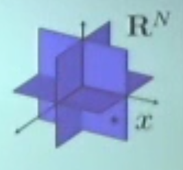
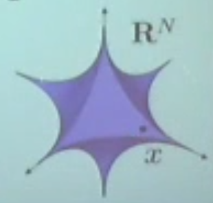
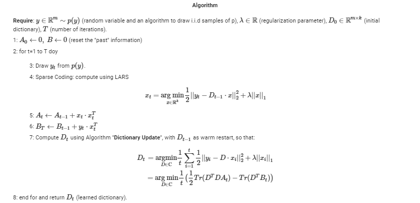
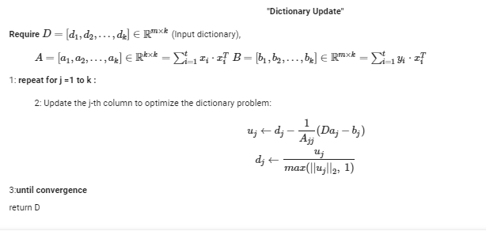

---

---

<h1 id="simple-introduction-to-compressive-sensing-and-dictionary-learning">Simple Introduction to Compressive Sensing and Dictionary Learning</h1>

An interesting Theory that recently I got to study is Compressive Sensing and Dictionary Learning, and here I will share with you some intuition that I had during my studies trying to keep thighs easy and practical. 
I made also a <a href="https://prezi.com/view/ft9eVbTF8aYyHALbDxMX/">Presentation</a> to  Compressive Sensing and Dictionary Learning and here you can also find my <a href="https://github.com/UmbertoJr/Compressive_Sensing_and_Dictionary_Learning/blob/master/CompressiveSensing_and_DictionaryLearning.ipynb">Jupyter Notebook</a> repository on this topic (I suggest you run it on ).

<h2 id="what-is-compressive-sensing-compressive-sensing-is-a-new">What is Compressive Sensing? </h2>
Compressive Sensing is a new 
 Theory that after the First paper <a href="http://statweb.stanford.edu/~candes/papers/ExactRecovery.pdf">Robust Uncertainty Principles: Exact Signal Reconstruction from Highly Incomplete Frequency Information</a> (June 2004) written by the noted <strong>Emmanuel Candes</strong>, <strong>Justin Romberg</strong> and <strong>Terence Tao</strong>, where they gave the proof that is possible to exactly recover an object from an incomplete frequency samples, by a convex optimization problem. 
While the Second paper of Compressive Sensing history is <a href="http://statweb.stanford.edu/~donoho/Reports/2004/l1l0approx.pdf">For Most Large Underdetermined Systems of Equations, the Minimal ` 1 -norm Near-Solution Approximates the Sparsest Near-Solution</a> (August 2004) written by David L. Donoho; here we have the most famous approach to the problem, that is the one that use the inexact linear equation , where  is a given n by m matrix and  is a sparse vector.  In general this problem requires combinatorial optimization and so is considered intractable. But his convex-relaxation using -minimization is convex, and is totally tractable.

 
If you want more go <a href="https://www.quora.com/What-are-the-seminal-papers-on-compressed-sensing">here </a>

<h2 id="lets-have-some-intuition-of-what-is-going-on...">Let’s have some intuition of what is going on…</h2>

Let’s start to think what it means that ,  if  is n by n matrix is means that we have n hyper-planes of dimension n each one that, if they are linearly indipendent, they will end to identify a single point. Then if we have that  is (n-1) by n this system of equation will end on a line, and so on… 
More dimensions we remove from the row then more dimensions we give to the hiper-plane that is the solution of the equations!!! 
So we could think that it seems that there is no single solution… but we should not forget that we want the solution to be the most sparse possible, and for this reason, the solution exists and is only one.

At least since 0-norm is an NP-problem we transform the problem to convex using 1-norm 

<h3 id="but-under-which-conditions-is-it-possible-the-unique-and-complete-recovery">But under which conditions is it possible the unique and complete recovery?</h3>
<blockquote>

Theorem: 
Given , the following properties are equivalent:

<blockquote>

a) If  and both are s-sparse, then .

</blockquote>
<blockquote>

b) The null-space of  does not contain any 2s-sparse vector other than the 0 vector

</blockquote>
<blockquote>

c) Every set of 2s columns of  is linearly independent

</blockquote>
</blockquote>
<h2 id="recovery-algorithms">Recovery algorithms</h2>

So up to now, we talk about some theory, let’s start talk coding…

 
<b>Basis Pursuit</b> 
 
  Consist in solve this simple convex problem:  &nbsp;
    
  
   &nbsp;  
<b>Lasso</b> 
  Is the famous convex problem:  
 
   &nbsp;  
<b>Orthogonal Matching Pursuit</b> 
 
     It's a greedy method that do the follow steps: 
<ul>
<li>

Initialization: 

</li>
<li>

Repeat until a stopping criterion is met: 

  
  
  

</li>
<li>

Output 

<h1 id="dictionary-learning">Dictionary Learning</h1>
</li>
</ul>

It’s a collection of algorithms focused on building, from some training data, a set of atoms/vectors that span a new space with the characteristic that the representation of the signal in such space is given by a sparse vector and each atom don’t need to be orthogonal to the other ones like for example in PCA.

So it’s also a method useful to build the matrix  that we used previously in the Compressive Sensing Theory . 
And to solve this task we need to solve the following optimization problem:

This is, of course, a non-convex optimization problem since the objective is non-convex.

<h3 id="how-to-solve-this-type-of-non-convex-problem">How to solve this type of non-convex problem?</h3>

In literature there are many different approaches to this problem and we will see just two of them:

 <b>Method of Optimal Directions (MOD)</b>

It consist simply in solve the sparse coding problem with one of the methods previously seen like <strong>Lasso</strong> and after updating the dictionary by computing the analytical solution of the problem given by  where the + is for the <strong>Moore-Penrose pseudoinverse</strong>. 
After this update D need to be renormalized to fit the constraints and this algorithm is recursive up to convergence.

 <b>   Online Dictionary Learning    </b>

When the size of the training size is too big or when the input data come in form of a stream, in such cases we are in the field of study of <strong>online learning</strong> which essentially suggests iteratively updating the model upon the new data points x becoming available.

This method allows us to gradually update the dictionary as new data becomes available for sparse representation learning and helps drastically reduce the amount of memory needed to store the dataset (which often has a huge size). 
The implementation of this algorithm is taken by the paper <a href="http://www.di.ens.fr/sierra/pdfs/icml09.pdf">Online Dictionary Learning for Sparse Coding</a> by Julien Mairal, Francis Bach, Jean Ponce, Guillermo Sapiro.

<em><strong>Thank you for reading and I remember you to star my repo and see the <a href="https://github.com/UmbertoJr/Compressive_Sensing_and_Dictionary_Learning/blob/master/CompressiveSensing_and_DictionaryLearning.ipynb">jupyter notebook</a> on colab</strong></em>

